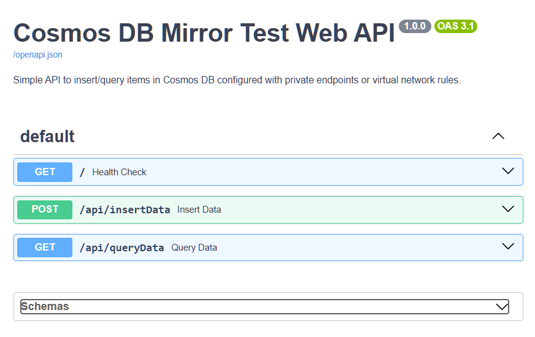

# Azure Web App with Cosmos DB Private Endpoint or Virtual Network

This project demonstrates an Azure Web App (App Service) that can be accessed from the public internet while securely connecting to a Cosmos DB account. The Cosmos connectivity is configurable: Private Endpoint (Private Link) or VNet firewall rules (service endpoint + Cosmos VNet rules).

## Architecture

- **Azure Web App**: HTTP-accessible Python (FastAPI) app, publicly available (Swagger UI at `/docs`)
- **VNet Integration**: Web App integrates with a VNet subnet (optionally route-all if you enable it)
- **Cosmos Connectivity**: Private Endpoint (Private Link) OR VNet firewall rules (`vnetRules` mode)
- **Managed Identity**: Authentication to Cosmos DB without connection strings

## Prerequisites

- [Azure CLI](https://docs.microsoft.com/cli/azure/install-azure-cli)
- [Azure Developer CLI (azd)](https://learn.microsoft.com/azure/developer/azure-developer-cli/install-azd)
- Python 3.11+ (only needed for local development)

## Configuration - Single Source of Truth

**Deployment configuration lives in:**

- `infra/main.bicep` (subscription-scope entrypoint + parameters)
- `infra/resources.bicep` (resource group resources)

Default values:

- `location`: `westcentralus` (if `AZURE_LOCATION` is not already set)
- `vnetAddressPrefix`: `172.21.1.0/27`
- `webAppSubnetAddressPrefix`: `172.21.1.0/28`
- `privateEndpointSubnetAddressPrefix`: `172.21.1.16/29`

**To customize:** Edit the parameter defaults in `infra/main.bicep`.

### Important: Avoiding VNet Address Conflicts

Before deploying, check for existing VNets that might conflict in your subscription

```bash
# Check for VNets in your subscription
az network vnet list --query "[].{Name:name, AddressSpace:addressSpace.addressPrefixes}" -o table

# If conflicts exist, change vnetAddressPrefix in infra/main.bicep
# Example: 172.21.2.0/24, 172.22.0.0/16, etc.
```

If you want to automatically pick a non-overlapping CIDR in your subscription, see the IP Planner helper tool in [tools/README.md](tools/README.md).

## Quick Start

### 1. Clone and Navigate

```bash
cd fabric-mirror-pe-app-testing
```

### 2. Login to Azure

```bash
az login
azd auth login
```

### 3. Deploy Everything

Optional: switch Cosmos connectivity mode.

- Default: `privateEndpoint` (Private Link + Private DNS)
- Alternative: `vnetRules` (Cosmos public network enabled + Service Endpoint + VNet firewall rules; no Private Endpoint)

```bash
azd env set COSMOS_NETWORK_MODE vnetRules
```

Note: set this **before** running `azd up`. If you change this after resources are created, `azd`/ARM incremental deployments will not delete an existing private endpoint automatically. Use a new azd environment name, or run `azd down --force --purge` and redeploy.

```bash
azd up
```

Follow prompts:

- Environment name. This sets your resource group name
- Subscription (select your Azure subscription)
- Location (select `westcentralus` to match default, or your preferred region)

The deployment will:

1. Create resource group with owner tag
1. Deploy VNet with subnets
1. Create Cosmos DB account using the selected mode (`privateEndpoint` or `vnetRules`)
1. Deploy Web App with VNet integration
1. Configure Managed Identity for Cosmos DB access
1. Deploy your web app code

### 4. Test the Web App

After deployment completes:

`azd` will print the Web App URL and the API docs URL (`/docs`) at the end of provisioning.

```bash
# Get the Web App URL
azd env get-values | grep webAppUrl

# Or from Azure CLI
az webapp list --query "[?starts_with(name, 'app-')].defaultHostName" -o tsv
```

Test the endpoints (recommended): open the Swagger UI and use **Try it out**.

- API docs: `https://<your-app>.azurewebsites.net/docs`
- Health: `GET /`
- Insert: `POST /api/insertData`
- Query: `GET /api/queryData`




Tip: App Service Python deployments can be slow because they often do a remote build (`pip install`) on every deploy.
If you want faster/more deterministic deploys later, you can build a zip package locally (includes dependencies) and deploy that:

```powershell
pwsh -File .\tools\build_local_package.ps1
```

This repo also sets the web app to use `Always On` and a health check path for more stable startup (applies on next provision/update).


## What Gets Deployed

The Bicep templates create:

1. Resource group with tags (`azd-env-name`, `owner`)
1. Virtual Network with two subnets (web app, private endpoints)
1. Cosmos DB account (mode-controlled: Private Endpoint or VNet rules; local auth disabled)
    - Continuous backup enabled (7-day tier)
1. Web App with VNet integration and Managed Identity
1. App Service Plan (Basic B1)
1. Private DNS zone for Cosmos DB (Private Endpoint mode only)
1. RBAC role assignments (Cosmos DB Data Contributor)


## Verification

### Check VNet Integration

```bash
# Get resource names
RG_NAME=$(azd env get-values | grep AZURE_RESOURCE_GROUP | cut -d'=' -f2)
WEBAPP_NAME=$(azd env get-values | grep WEBAPP_NAME | cut -d'=' -f2)

# Verify VNet integration
az webapp vnet-integration list --name $WEBAPP_NAME --resource-group $RG_NAME
```

### Test Private Endpoint Connectivity

The Cosmos DB Data Explorer in the Azure Portal will NOT work because:

- Cosmos DB has `publicNetworkAccess: Disabled`
- Portal cannot connect through your private endpoint
- This is expected and correct behavior

To verify data, use the web app's query endpoint:

To verify data, open the Swagger UI (`https://<your-app>.azurewebsites.net/docs`) and run `GET /api/queryData` using **Try it out**.

## Cleanup

```bash
azd down --force --purge
```

This removes all Azure resources created by the deployment.

## Troubleshooting

### VNet Address Conflicts

If deployment fails with "The address space ... is already in use":

1. Check existing VNets: `az network vnet list`
2. Edit `vnetAddressPrefix` in `infra/main.bicep`
3. Choose a non-conflicting range (e.g., `10.5.1.0/24`)
4. Run `azd up` again

### Cosmos DB Connection Issues

If the web app can't connect to Cosmos DB:

1. Verify VNet integration is active
2. Check private DNS zone is linked to VNet
3. Verify Managed Identity has Cosmos DB Data Contributor role
4. Check web app logs: `az webapp log tail --name $WEBAPP_NAME --resource-group $RG_NAME`
