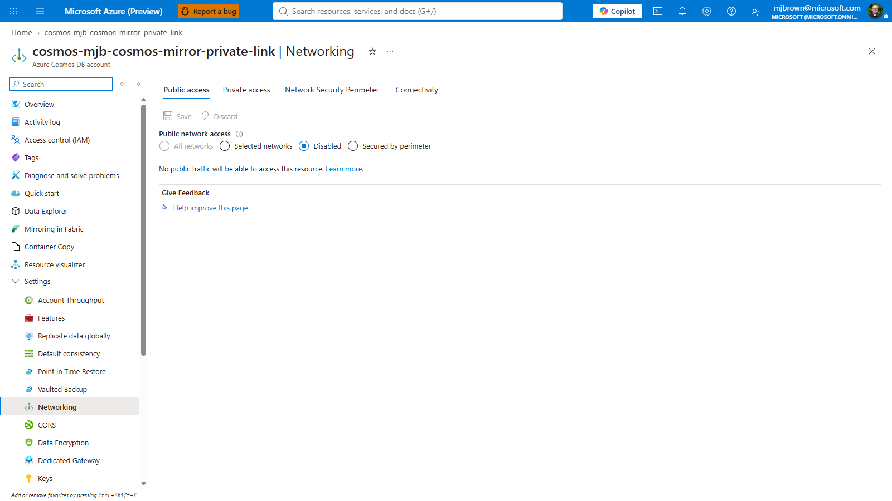
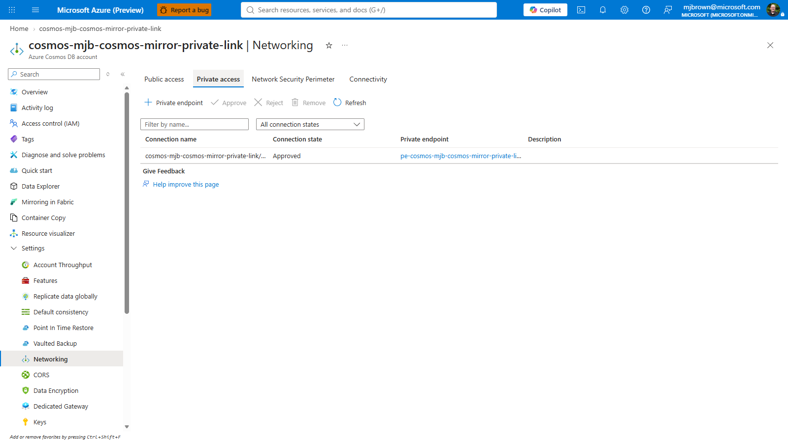
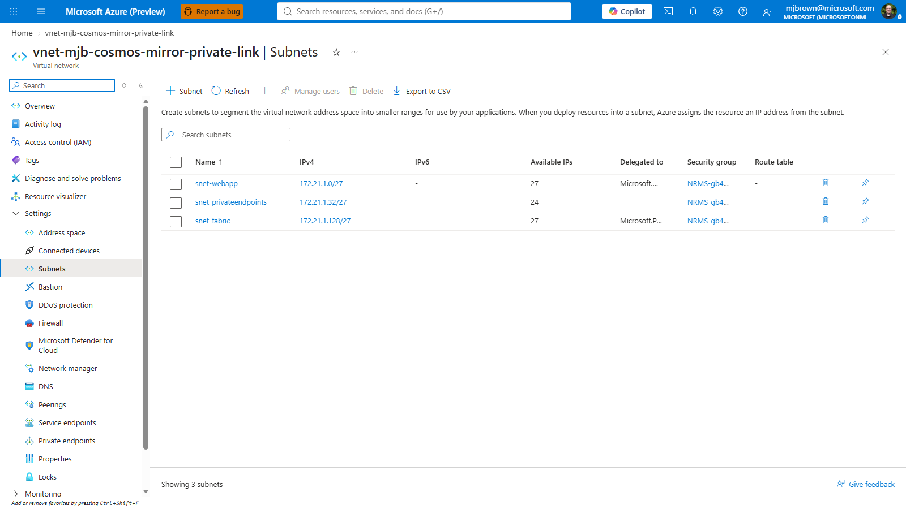
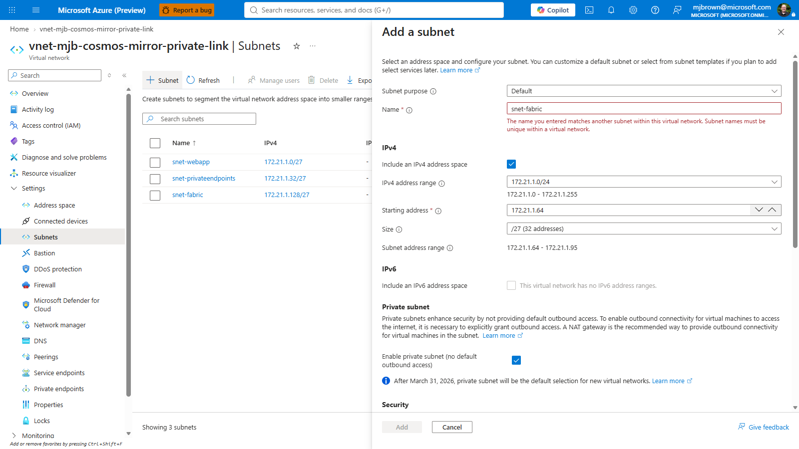
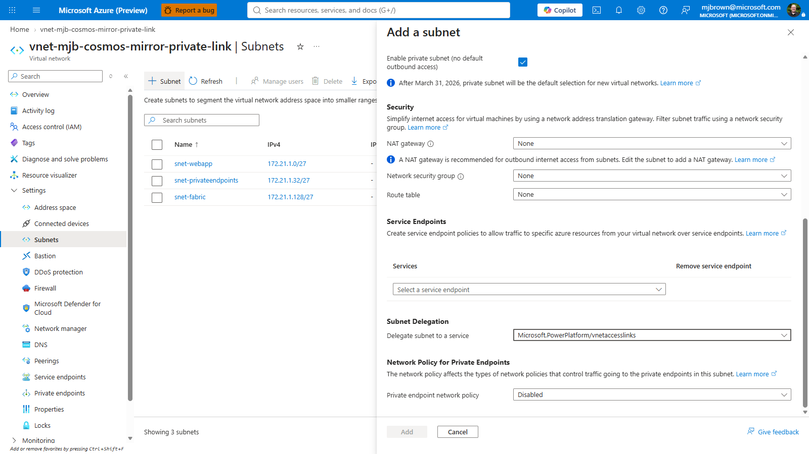

# Enable Cosmos DB Fabric Mirroring over Private Link (VNet Data Gateway)

This guide shows how to mirror an **Azure Cosmos DB for NoSQL** account into
**Microsoft Fabric** when the account has **public network access disabled** and is
reachable only over a **Private Endpoint / VNet**, **without** maintaining the large
DataFactory / PowerQueryOnline IP allowlists.

It uses a **Fabric Virtual Network Data Gateway** that lives *inside your VNet* and
reaches Cosmos privately, plus a trusted-workspace **network ACL bypass**. This is a
newer, lower-maintenance alternative to the IP-allowlist flow in the
[official Learn guide](https://learn.microsoft.com/fabric/mirroring/azure-cosmos-db-private-network).

> **How much can be automated?** Everything except one step. The Cosmos + network
> resources, RBAC, the network ACL bypass, the delegated subnet, the gateway, and the
> mirror itself can all be provisioned with Bicep + PowerShell/REST. The **only** manual
> step is creating the **Azure Cosmos DB v2 connection**, which requires an interactive
> **OAuth 2.0** sign-in in the Fabric portal and cannot be scripted.

## Two approaches, and why this one

| | IP-allowlist approach ([Learn doc](https://learn.microsoft.com/fabric/mirroring/azure-cosmos-db-private-network)) | **VNet Data Gateway approach (this guide)** |
|---|---|---|
| How Fabric reaches Cosmos | Temporarily open **Selected networks** + add ~400–1200 DataFactory/PowerQueryOnline IPs (or NSP service tags) | A **VNet Data Gateway** in a delegated subnet reaches Cosmos over the private network |
| Ongoing firewall maintenance | Yes — service IP ranges change over time | **None** |
| Public access during setup | Briefly re-enabled (Selected networks) | Can stay **Disabled** the whole time |
| Mirror creation | Fabric UX | Fabric UX **or** REST API |

Both approaches still use the same trust primitive: **`EnableFabricNetworkAclBypass`**
plus authorizing your Fabric **workspace ID** as a trusted resource.

## Architecture

| Component | Configuration |
|---|---|
| Cosmos networking | `publicNetworkAccess = Disabled` |
| Private connectivity | Private Endpoint + Private DNS (`privatelink.documents.azure.com`) |
| Trust | `EnableFabricNetworkAclBypass` capability + `networkAclBypass = AzureServices` authorizing the Fabric workspace resource id |
| RBAC | Fabric workspace identity gets **Built-in Data Contributor** + a custom **metadata/analytics reader** role |
| Gateway subnet | Dedicated empty subnet delegated to `Microsoft.PowerPlatform/vnetaccesslinks` |
| Fabric connection | **Azure Cosmos DB v2**, connectivity = **Virtual Network**, auth = **OAuth 2.0** |
| Mirror | Started via Fabric REST API (or UX) |

## Prerequisites

- An Azure Cosmos DB for NoSQL account configured for mirroring: **continuous backup**
  (7 or 30 day), **Entra ID auth**, local auth disabled.
- The Cosmos account and Fabric workspace in the **same Azure region**.
- An existing **Fabric workspace** (use a *shared* workspace, not *My workspace*) on a
  **Fabric capacity**.
- You are an **Admin** on the Fabric workspace and have **Contributor + RBAC-assignment**
  rights on the Cosmos account/subscription.
- Az PowerShell (`Az.Accounts`, `Az.CosmosDB`, `Az.Resources`, `Az.Network`) for the
  scripts.

---

## Step-by-step

### Step 0 — Provision Cosmos + VNet (Bicep)

If you use this repo's harness, `azd up` provisions the private-network Cosmos + VNet.
To also provision the mirroring trust + gateway subnet declaratively, set the Fabric
workspace values before deploying:

```bash
azd env set COSMOS_NETWORK_MODE privateEndpoint
azd env set FABRIC_WORKSPACE_ID   <fabric-workspace-guid>
azd env set FABRIC_TENANT_ID      <fabric-tenant-guid>          # optional; defaults to sub tenant
# optional: grant the custom mirroring RBAC role to the workspace identity at deploy time
azd env set FABRIC_WORKSPACE_PRINCIPAL_ID <workspace-identity-object-id>
azd up
```

When `FABRIC_WORKSPACE_ID` is set, `infra/resources.bicep` adds, in one deployment:

- the `EnableFabricNetworkAclBypass` capability,
- `networkAclBypass = AzureServices` + the trusted workspace resource id,
- a custom **Fabric Mirroring Metadata Reader** role (and, if a principal id is given,
  assigns it plus **Built-in Data Contributor** to the workspace identity),
- the delegated `snet-fabric` subnet (`Microsoft.PowerPlatform/vnetaccesslinks`, min `/27`).
  This subnet is only added when `FABRIC_WORKSPACE_ID` is set — a plain private-link
  deployment does not include it.

> Prefer to keep Bicep untouched? Skip the Fabric params and run the PowerShell script in
> Step 1 instead — it applies the same Cosmos-side configuration idempotently. In that case
> you must create the delegated gateway subnet yourself first — see the next section.

### Step 0b — Create the delegated gateway subnet (manual)

A standard private-link Cosmos deployment has only your **web app** and **private endpoint**
subnets — it does **not** include a gateway subnet. The Fabric VNet Data Gateway needs its
own dedicated, delegated subnet, so add one to the VNet that hosts (or peers with) the
Cosmos private endpoint.

**In the Azure portal:**

Your Cosmos DB account is reachable through an approved **private endpoint** — this is the
starting point (public network access is *Disabled*):





1. Open the **Cosmos DB account → Networking** (you're likely already here). On the
   **Private access** tab, click the private endpoint, then open its **Virtual network** to
   jump to the VNet. (Or go straight to **Virtual networks → your VNet**.)
2. Select **Subnets → + Subnet**.

   

3. Configure the subnet:

   | Setting | Value | Notes |
   |---|---|---|
   | **Name** | `snet-fabric` | Any name; dedicated to the gateway |
   | **Address range** | e.g. `10.x.y.0/27` | **Minimum `/27` (32 IPs)** — smaller is rejected. Must not overlap other subnets |
   | **Subnet delegation** | `Microsoft.PowerPlatform/vnetaccesslinks` | Required — this is what makes it a gateway subnet |
   | **Network security group** | None (or your own) | Optional |
   | **Route table** | None (or your own) | Optional |
   | **Private endpoint network policies** | Disabled | Recommended |

   

   Under **Subnet Delegation → Delegate subnet to a service**, choose
   `Microsoft.PowerPlatform/vnetaccesslinks`:

   

4. Select **Save** / **Add**.

**IP address range — what's required:**

- **Minimum size: `/27` (32 addresses).** Azure reserves 5 per subnet; the gateway
  provisions multiple member nodes, so `/27` is the smallest supported. Use a larger range
  (`/26`, `/25`) only if you plan to scale the gateway to many members.
- The subnet must be **dedicated** — no other resources (VMs, other private endpoints, etc.)
  may live in it.
- It must have **network line-of-sight** to the Cosmos account: same VNet as the private
  endpoint, or a **peered** VNet with routing, and it must be able to **resolve the Cosmos
  private DNS** name (`privatelink.documents.azure.com`) to the private IP.
- Pick a range that does **not** overlap `10.0.1.x` (used internally by the gateway).

> Tip: in this repo's `/24` VNets the gateway subnet defaults to the 5th `/27`
> (`…​.128/27`), leaving the web app (`.0/27`) and private endpoints (`.32/27`) untouched.

### Step 1 — Configure Cosmos trust + gateway (PowerShell)

```powershell
Connect-AzAccount
./tools/setup-mirroring-private-link.ps1 `
  -SubscriptionId     <sub-guid> `
  -ResourceGroup      rg-<env> `
  -CosmosAccountName  cosmos-<env> `
  -VNetName           vnet-<env> `
  -FabricSubnetName   snet-fabric `
  -FabricWorkspaceId  <fabric-workspace-guid> `
  -CapacityId         <fabric-capacity-guid> `
  -CosmosDatabaseName CosmosMirrorDatabase `
  -MirrorName         <env>-mirror
```

This script:

1. Registers the `Microsoft.PowerPlatform` resource provider.
2. Verifies the delegated gateway subnet exists.
3. Enables `EnableFabricNetworkAclBypass`.
4. Authorizes the trusted Fabric workspace (`networkAclBypass = AzureServices`).
5. Creates (or reuses) the **Fabric VNet Data Gateway** bound to `snet-fabric`.
6. Stops at the manual OAuth gate (Step 2), then — once you supply the connection —
   creates and starts the mirror (Step 3).

### Step 2 — Create the Azure Cosmos DB v2 connection (manual, OAuth)

This is the one step that can't be automated.

1. Fabric portal → **Settings** → **Manage connections and gateways** → **Connections**
   → **+ New**.
2. Connection type: **Azure Cosmos DB v2**. Connectivity: **Virtual Network**.
3. Gateway: the VNet Data Gateway created in Step 1.
4. Authentication kind: **OAuth 2.0** (Organizational account).
5. Endpoint: `https://<account-name>.documents.azure.com:443/`
6. **Test connection** → **Create**. Copy the connection's name or id.

### Step 3 — Create and start the mirror (REST)

Re-run the setup script with the connection you just created:

```powershell
./tools/setup-mirroring-private-link.ps1 `
  -SubscriptionId <sub-guid> -ResourceGroup rg-<env> -CosmosAccountName cosmos-<env> `
  -VNetName vnet-<env> -FabricWorkspaceId <ws-guid> `
  -CosmosDatabaseName CosmosMirrorDatabase -MirrorName <env>-mirror `
  -ConnectionId <cosmos-v2-connection-guid>          # or -ConnectionName "<name>"
```

It creates the mirrored database via `POST /v1/workspaces/{ws}/mirroredDatabases` with a
`CosmosDb` source referencing the connection, then calls `startMirroring`. Alternatively,
create the mirror in the Fabric UX (**Create → Mirrored Azure Cosmos DB**), or use the
[`AzureCosmosDB/fabric-cosmos-mirror`](https://github.com/AzureCosmosDB/fabric-cosmos-mirror)
Python sample.

### Step 4 — Verify

In the mirrored database, open **Monitor replication**. Status should reach *Running* and
row counts should climb. Because public access stays **Disabled**, this proves Fabric is
reaching Cosmos through the trusted-workspace bypass over the private gateway.

---

## Reset (re-run from a clean baseline)

To reset the account's network ACL (e.g., remove the leftover IP allowlist from an older
setup) and, optionally, named Fabric artifacts, use the reset script. It is **dry-run by
default**; add `-Execute` to apply. Fabric deletions require **explicit ids** so a shared
workspace is never touched by accident.

```powershell
# Preview only:
./tools/reset-mirroring-private-link.ps1 -SubscriptionId <sub> -ResourceGroup rg-<env> -CosmosAccountName cosmos-<env>

# Clear leftover IP firewall rules for real:
./tools/reset-mirroring-private-link.ps1 -SubscriptionId <sub> -ResourceGroup rg-<env> -CosmosAccountName cosmos-<env> -Execute

# Full reset incl. a specific mirror + connection:
./tools/reset-mirroring-private-link.ps1 -SubscriptionId <sub> -ResourceGroup rg-<env> -CosmosAccountName cosmos-<env> `
  -ClearAclBypass -RemoveCapability -FabricWorkspaceId <ws> -MirrorId <m> -ConnectionId <c> -Execute
```

## Automation summary

| Step | Automatable | Mechanism |
|---|---|---|
| Cosmos + VNet + Private Endpoint + DNS | ✅ | Bicep (`infra/resources.bicep`) |
| Mirroring RBAC (custom role + assignments) | ✅ | Bicep or `Az.CosmosDB` |
| `EnableFabricNetworkAclBypass` | ✅ | Bicep `capabilities[]` / `Set-AzResource -UsePatchSemantics` |
| Trusted workspace ACL bypass | ✅ | Bicep or `Update-AzCosmosDBAccount -NetworkAclBypassResourceId` |
| Register `Microsoft.PowerPlatform` | ✅ | `Register-AzResourceProvider` |
| Delegated gateway subnet | ✅ | Bicep subnet `delegations[]` |
| Fabric VNet Data Gateway | ✅ | Fabric REST `POST /v1/gateways` |
| **Cosmos DB v2 connection (OAuth 2.0)** | ❌ | **Manual — interactive OAuth in Fabric UX** |
| Create + start mirror | ✅ | Fabric REST `POST /v1/workspaces/{ws}/mirroredDatabases` |

## Notes & gotchas

- The gateway subnet must be **empty** and **dedicated**, delegated to
  `Microsoft.PowerPlatform/vnetaccesslinks`, and able to resolve the Cosmos private DNS
  name. This repo defaults it to the 5th `/27` of the VNet (`snet-fabric`).
- Private network mirroring supports **OAuth-based auth only** for the Cosmos v2
  connection.
- Keep the trusted-workspace bypass and `EnableFabricNetworkAclBypass` in place after
  setup — they are what let Fabric keep replicating with public access disabled. Only the
  **IP firewall rules** from the older approach are safe to remove.
- Cosmos account and Fabric capacity must be in the **same region**.
