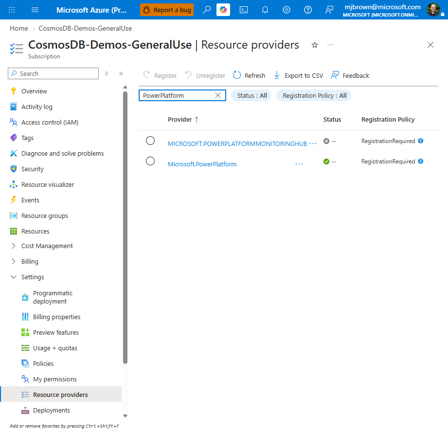

# Enable Cosmos DB Fabric Mirroring over Private Link (VNet Data Gateway)

This is a walkthrough for mirroring an **Azure Cosmos DB for NoSQL**
account into **Microsoft Fabric** when the account has **public network access disabled**
and is reachable only over a **Private Endpoint / VNet** — **without** maintaining the large
DataFactory / PowerQueryOnline IP allowlists.

It uses a **Fabric Virtual Network Data Gateway** that runs *inside your VNet* and reaches
Cosmos privately, plus a trusted-workspace **network ACL bypass**.

> Most steps are done by clicking in the **Azure portal** and the **Fabric portal**. Three
> Cosmos-account settings (the network ACL bypass capability, the trusted-workspace
> authorization, and data-plane RBAC) don't have a portal control, so **Step 3** provides the
> bare **Azure CLI** / **Azure PowerShell** commands for them.

## Why this approach

| | IP-allowlist approach ([Learn doc](https://learn.microsoft.com/fabric/mirroring/azure-cosmos-db-private-network)) | **VNet Data Gateway approach (this guide)** |
|---|---|---|
| How Fabric reaches Cosmos | Temporarily open **Selected networks** + add ~400–1200 DataFactory/PowerQueryOnline IPs | A **VNet Data Gateway** in a delegated subnet reaches Cosmos over the private network |
| Ongoing firewall maintenance | Yes — service IP ranges change over time | **None** |
| Public access during setup | Briefly re-enabled | Stays **Disabled** the whole time |

## Prerequisites

- An Azure Cosmos DB for NoSQL account with **continuous backup** (7 or 30 day), **Entra ID
  auth**, local auth disabled, and **public network access = Disabled** behind a **private
  endpoint**.
- A **Fabric workspace** (use a *shared* workspace, not *My workspace*) on a **Fabric
  capacity**, in the **same Azure region** as the Cosmos account.
- You are an **Azure subscription owner** (required to configure the trusted workspace) and a
  **Fabric workspace Admin**.
- Your VNet does **not** yet have a gateway subnet — you'll create it in Step 2.

Get your **Fabric workspace ID** now: open the workspace in the Fabric portal and copy the
GUID from the URL — `.../groups/{workspace-id}/...`. You'll need it in Steps 3 and 4.

---

# Part 1 — Azure portal: prepare the Cosmos account and network

## Step 1 — Register the Microsoft.PowerPlatform resource provider

1. In the Azure portal, open your **Subscription**.
2. Under **Settings**, select **Resource providers**.
3. Search for **`Microsoft.PowerPlatform`**, select it, and choose **Register** (skip if it
   already shows **Registered**).



## Step 2 — Create the delegated gateway subnet

A standard private-link Cosmos deployment has only your **web app** and **private endpoint**
subnets — it does **not** include a gateway subnet. The Fabric VNet Data Gateway needs its own
dedicated, delegated subnet.

Your account is reachable through an approved **private endpoint** (public access is
*Disabled*) — that's the starting point:


1. From the Cosmos account **Networking → Private access**, open the private endpoint, then
   its **Virtual network** (or go directly to **Virtual networks → your VNet**).
2. Select **Subnets → + Subnet**.

   

3. Configure the subnet:

   | Setting | Value | Notes |
   |---|---|---|
   | **Name** | `snet-fabric` | Any name; dedicated to the gateway |
   | **Size / address range** | `/27` (32 IPs) | **Minimum `/27`** — smaller is rejected. Must not overlap other subnets |
   | **Subnet delegation** | `Microsoft.PowerPlatform/vnetaccesslinks` | Required — this is what makes it a gateway subnet |
   | **Private endpoint network policies** | Disabled | Recommended |

   

   Under **Subnet Delegation → Delegate subnet to a service**, choose
   `Microsoft.PowerPlatform/vnetaccesslinks`:

   

4. Select **Add**.

**About the IP range:** minimum **`/27` (32 addresses)**; the subnet must be **dedicated**
(no other resources); it must have **line-of-sight** to Cosmos (same VNet as the private
endpoint, or a peered VNet with routing) and resolve the Cosmos private DNS
(`privatelink.documents.azure.com`); avoid overlapping `10.0.1.x`.

## Step 3 — Configure Cosmos trust and RBAC (CLI / PowerShell)

These three settings (data-plane RBAC, the `EnableFabricNetworkAclBypass` capability, and the
trusted-workspace authorization) are set with the bare commands below — pick **Azure CLI** or
**Azure PowerShell**. Run them once against the Cosmos account.

### Azure CLI

```bash
RG="rg-<env>"
ACCT="cosmos-<env>"
WSID="<fabric-workspace-id>"                     # GUID from the Fabric workspace URL
TENANT=$(az account show --query tenantId -o tsv)
ME=$(az ad signed-in-user show --query id -o tsv)

# 3a. Data-plane RBAC (custom metadata/analytics reader + Built-in Data Contributor)
az cosmosdb sql role definition create -a "$ACCT" -g "$RG" --body '{
  "RoleName": "Fabric Mirroring Metadata Reader",
  "Type": "CustomRole",
  "AssignableScopes": ["/"],
  "Permissions": [{ "DataActions": [
    "Microsoft.DocumentDB/databaseAccounts/readMetadata",
    "Microsoft.DocumentDB/databaseAccounts/readAnalytics"
  ]}]
}'
ROLE_ID=$(az cosmosdb sql role definition list -a "$ACCT" -g "$RG" \
  --query "[?roleName=='Fabric Mirroring Metadata Reader'].id | [0]" -o tsv)
az cosmosdb sql role assignment create -a "$ACCT" -g "$RG" --scope "/" \
  --principal-id "$ME" --role-definition-id "$ROLE_ID"
az cosmosdb sql role assignment create -a "$ACCT" -g "$RG" --scope "/" \
  --principal-id "$ME" --role-definition-id 00000000-0000-0000-0000-000000000002

# 3b. Enable the Fabric network ACL bypass capability
az cosmosdb update -g "$RG" -n "$ACCT" --capabilities EnableFabricNetworkAclBypass

# 3c. Authorize the trusted Fabric workspace
az cosmosdb update -g "$RG" -n "$ACCT" --network-acl-bypass AzureServices \
  --network-acl-bypass-resource-ids \
  "/tenants/$TENANT/subscriptions/00000000-0000-0000-0000-000000000000/resourceGroups/Fabric/providers/Microsoft.Fabric/workspaces/$WSID"
```

### Azure PowerShell

```powershell
$RG    = "rg-<env>"
$ACCT  = "cosmos-<env>"
$WSID  = "<fabric-workspace-id>"                 # GUID from the Fabric workspace URL
$TENANT = (Get-AzContext).Tenant.Id
$ME     = (Get-AzADUser -SignedIn).Id

# 3a. Data-plane RBAC (custom metadata/analytics reader + Built-in Data Contributor)
New-AzCosmosDBSqlRoleDefinition -AccountName $ACCT -ResourceGroupName $RG `
  -Type CustomRole -RoleName "Fabric Mirroring Metadata Reader" -AssignableScope "/" `
  -DataAction @(
    'Microsoft.DocumentDB/databaseAccounts/readMetadata',
    'Microsoft.DocumentDB/databaseAccounts/readAnalytics')
$roleId = (Get-AzCosmosDBSqlRoleDefinition -AccountName $ACCT -ResourceGroupName $RG |
  Where-Object RoleName -eq "Fabric Mirroring Metadata Reader").Id
New-AzCosmosDBSqlRoleAssignment -AccountName $ACCT -ResourceGroupName $RG -Scope "/" `
  -PrincipalId $ME -RoleDefinitionId $roleId
New-AzCosmosDBSqlRoleAssignment -AccountName $ACCT -ResourceGroupName $RG -Scope "/" `
  -PrincipalId $ME -RoleDefinitionName "Cosmos DB Built-in Data Contributor"

# 3b. Enable the Fabric network ACL bypass capability
$c = Get-AzResource -ResourceGroupName $RG -Name $ACCT -ResourceType "Microsoft.DocumentDB/databaseAccounts"
$c.Properties.capabilities += @{ name = "EnableFabricNetworkAclBypass" }
$c | Set-AzResource -UsePatchSemantics -Force

# 3c. Authorize the trusted Fabric workspace
Update-AzCosmosDBAccount -ResourceGroupName $RG -Name $ACCT -NetworkAclBypass AzureServices `
  -NetworkAclBypassResourceId "/tenants/$TENANT/subscriptions/00000000-0000-0000-0000-000000000000/resourceGroups/Fabric/providers/Microsoft.Fabric/workspaces/$WSID"
```

> The CLI `--capabilities` flag replaces the capability set — if the account already has other
> capabilities, include them all. Azure also surfaces these same steps in the Cosmos account's
> **Mirroring in Fabric** blade (**Apply RBAC policies** / **Configure private networks**).

---

# Part 2 — Fabric portal: gateway, connection, and mirror

## Step 4 — Create the VNet Data Gateway

1. In the **Fabric portal**, select the **gear (Settings)** → **Manage connections and
   gateways**.
2. Open the **Virtual network data gateways** tab → **+ New**.
3. Provide: **Subscription**, **Resource group**, **Virtual network** (`vnet-<env>`),
   **Subnet** (`snet-fabric` from Step 2), a **Gateway name**, and an inactivity timeout.
4. Select **Create**. Fabric provisions the gateway inside your VNet, in the same region.

## Step 5 — Create the Azure Cosmos DB v2 connection (OAuth)

1. Still under **Manage connections and gateways**, open **Connections → + New**.
2. **Connection type:** `Azure Cosmos DB v2`. **Connectivity:** **Virtual Network**, and select
   the **gateway** created in Step 4.
3. **Azure Cosmos DB endpoint:** `https://<account-name>.documents.azure.com:443/`
4. **Authentication kind:** **OAuth 2.0** (Organizational account) → sign in.
5. Select **Test connection**, then **Create**.

> Private-network mirroring supports **OAuth-based authentication only**. This is the one step
> that always requires an interactive sign-in.

## Step 6 — Create the mirrored database

1. In your **Fabric workspace**, select **+ New item → Mirrored Azure Cosmos DB** (or
   **Create → Mirror data → Mirrored Azure Cosmos DB**).
2. Choose the **Azure Cosmos DB v2** connection from Step 5.
3. Select the **database** (and, optionally, specific containers) to mirror.
4. Select **Connect / Create** to start mirroring.

## Step 7 — Verify

In the mirrored database, open **Monitor replication**. The status should reach *Running* and
row counts should climb — all while Cosmos public access stays **Disabled**, proving Fabric is
reaching the account through the trusted-workspace bypass over the private gateway.

---

## Reset — start over from a clean baseline

1. **Fabric portal:** delete the **mirrored database**, then the **Cosmos DB v2 connection**,
   then the **VNet Data Gateway** (Manage connections and gateways).
2. **Azure portal:** delete the **`snet-fabric`** subnet (Virtual network → Subnets). If it
   reports *in use by PowerPlatformSAL*, wait — Power Platform releases the delegation link
   **asynchronously** after the gateway is deleted (can take up to ~1 hour), then retry.
3. **CLI** (to undo the Step 3 settings):

   ```bash
   az cosmosdb update -g "$RG" -n "$ACCT" --network-acl-bypass None
   az cosmosdb update -g "$RG" -n "$ACCT" --capabilities ""    # remove EnableFabricNetworkAclBypass
   ```

## Where each step is done

| Step | Where |
|---|---|
| Register `Microsoft.PowerPlatform` | Azure portal |
| Delegated gateway subnet | Azure portal |
| Data-plane RBAC | Azure CLI / PowerShell |
| `EnableFabricNetworkAclBypass` | Azure CLI / PowerShell |
| Trusted-workspace authorization | Azure CLI / PowerShell |
| VNet Data Gateway | Fabric portal |
| Cosmos DB v2 connection (OAuth) | Fabric portal (interactive sign-in) |
| Mirrored database | Fabric portal |

> Prefer infrastructure-as-code instead of the manual flow? The repo's `infra/` Bicep and
> `tools/*.ps1` scripts automate Parts 1 and 2 (except the interactive OAuth connection). They
> are entirely optional and not required for this walkthrough.
