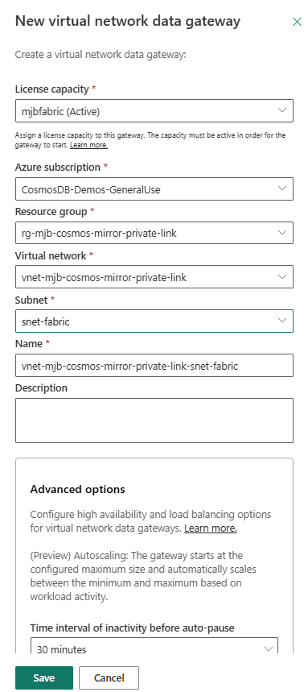
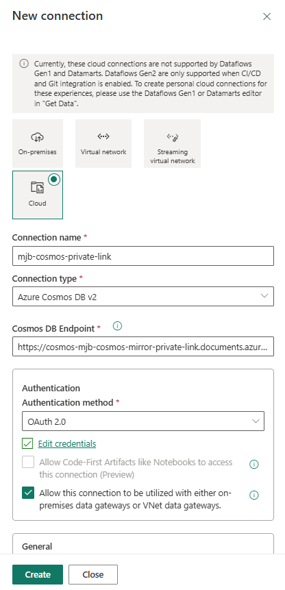

# Enable Cosmos DB Fabric Mirroring over Private Link (VNet Data Gateway)

This is a walkthrough for mirroring an **Azure Cosmos DB for NoSQL**
account into **Microsoft Fabric** when the account has **public network access disabled**
and is reachable only over a **Private Endpoint / VNet** — **without** maintaining the large
DataFactory / PowerQueryOnline IP allowlists.

It uses a **Fabric Virtual Network Data Gateway** that runs *inside your VNet* and reaches
Cosmos privately, plus a trusted-workspace **network ACL bypass**.

> Most steps are done by clicking in the **Azure portal** and the **Fabric portal**. Three
> Cosmos-account settings (the network ACL bypass capability, the trusted-workspace
> authorization, and data-plane RBAC) don't have a portal control, so **Steps 2–4** provide the
> bare **Azure CLI** / **Azure PowerShell** commands for them.

> ### ⛔ Known limitation — the mirror can't be finished in the portal
> The **Mirroring UX cannot use a VNet data gateway connection.** *New mirrored Azure Cosmos DB
> → New source → Azure Cosmos DB v2* only offers **cloud** connections (Account key / OAuth
> without a gateway), so the VNet gateway connection created in **Step 6** is **not selectable**
> there. As a result, a private-network mirrored database **must be created via the Fabric REST
> API** (**Step 7**). This is a current product gap in the Fabric Mirroring experience, not a
> configuration mistake.

## Why this approach

| | IP-allowlist approach ([Learn doc](https://learn.microsoft.com/fabric/mirroring/azure-cosmos-db-private-network)) | **VNet Data Gateway approach (this guide)** |
|---|---|---|
| How Fabric reaches Cosmos | Temporarily open **Selected networks** + add ~400–1200 DataFactory/PowerQueryOnline IPs | A **VNet Data Gateway** in a delegated subnet reaches Cosmos over the private network |
| Ongoing firewall maintenance | Yes — service IP ranges change over time | **None** |
| Public access during setup | Briefly re-enabled | Stays **Disabled** the whole time |

## Prerequisites

- An Azure Cosmos DB for NoSQL account with **continuous backup** (7 or 30 day), **Entra ID
  auth**, local auth disabled, and **public network access = Disabled** behind a **private
  endpoint**.
- A **Fabric workspace** (use a *shared* workspace, not *My workspace*) on a **Fabric
  capacity**, in the **same Azure region** as the Cosmos account.
- You are an **Azure subscription owner** (required to configure the trusted workspace) and a
  **Fabric workspace Admin**.
- Your VNet does **not** yet have a gateway subnet — you'll create it in Step 1.
- The **`Microsoft.PowerPlatform`** resource provider is registered on the subscription (see
  below).

Get your **Fabric workspace ID** now: open the workspace in the Fabric portal and copy the
GUID from the URL — `.../groups/{workspace-id}/...`. You'll need it in Steps 4 and 5.

> 💡 **Keep one terminal open for the whole walkthrough.** Several steps set shell variables
> (`$RESOURCE_GROUP`, `$COSMOS_ACCOUNT`, `$FABRIC_WORKSPACE_ID`, …) and later steps reuse them. If you close your PowerShell
> or Bash/Cloud Shell session you'll have to re-declare them — use the **same** session from
> here through Step 7.

### Register the `Microsoft.PowerPlatform` resource provider

Registering this provider lets the Fabric Virtual Network Data Gateway create its link into
your VNet.

**Portal:** open your **Subscription → Settings → Resource providers**, search for
**`Microsoft.PowerPlatform`**, select it, and choose **Register** (skip if it already shows
**Registered**).


**Azure CLI**

```bash
SUB="<subscription-id>"
az account set --subscription "$SUB"
az provider register --namespace Microsoft.PowerPlatform
# Verify (repeat until it prints "Registered" — registration is async)
az provider show --namespace Microsoft.PowerPlatform --query registrationState -o tsv
```

**Azure PowerShell**

```powershell
Set-AzContext -Subscription "<subscription-id>"
Register-AzResourceProvider -ProviderNamespace Microsoft.PowerPlatform
# Verify (repeat until it prints "Registered" — registration is async)
(Get-AzResourceProvider -ProviderNamespace Microsoft.PowerPlatform).RegistrationState
```

---

# Part 1 — Azure portal: prepare the Cosmos account and network

## Step 1 — Create the delegated gateway subnet

A standard private-link Cosmos deployment has only your **web app** and **private endpoint**
subnets — it does **not** include a gateway subnet. The Fabric VNet Data Gateway needs its own
dedicated, delegated subnet.

Your account is reachable through an approved **private endpoint** (public access is
*Disabled*) — that's the starting point:


1. From the Cosmos account **Networking → Private access**, open the private endpoint, then
   its **Virtual network** (or go directly to **Virtual networks → your VNet**).
2. Select **Subnets → + Subnet**.

   

3. Configure the subnet:

   | Setting | Value | Notes |
   |---|---|---|
   | **Name** | `snet-fabric` | Any name; dedicated to the gateway |
   | **Size / address range** | `/27` (32 IPs) | **Minimum `/27`** — smaller is rejected. Must not overlap other subnets |
   | **Enable private subnet (no default outbound access)** | **Unchecked** | Leave this **unchecked** so the subnet keeps default outbound access to Azure AD — required for the Step 6 OAuth sign-in |
   | **Subnet delegation** | `Microsoft.PowerPlatform/vnetaccesslinks` | Required — this is what makes it a gateway subnet |
   | **Private endpoint network policies** | Disabled | Recommended |

   

   > **Leave "Enable private subnet (no default outbound access)" *unchecked*** (as shown
   > above). This keeps default outbound access so the gateway can reach Azure AD for the
   > Step 6 OAuth sign-in. See the outbound note below.

   Under **Subnet Delegation → Delegate subnet to a service**, choose
   `Microsoft.PowerPlatform/vnetaccesslinks` (note the private-subnet box remains unchecked):

   

4. Select **Add**.

**About the IP range:** minimum **`/27` (32 addresses)**; the subnet must be **dedicated**
(no other resources); it must have **line-of-sight** to Cosmos (same VNet as the private
endpoint, or a peered VNet with routing) and resolve the Cosmos private DNS
(`privatelink.documents.azure.com`); avoid overlapping `10.0.1.x`.

> **Why leave it unchecked?** The VNet data gateway must reach **Azure AD
> (`login.microsoftonline.com`)** to complete the OAuth sign-in in **Step 6**. Leaving
> **"Enable private subnet (no default outbound access)"** unchecked keeps the default outbound
> access the gateway needs.

## Step 2 — Grant Cosmos data-plane RBAC

Grant the identity that will create the Fabric connection (typically you) the metadata and
analytics read actions Fabric mirroring needs, plus **Built-in Data Contributor**. Cosmos
data-plane RBAC has no portal control — use the CLI or PowerShell.

**Azure CLI**

```bash
RESOURCE_GROUP="rg-<env>"
COSMOS_ACCOUNT="cosmos-<env>"
PRINCIPAL_ID=$(az ad signed-in-user show --query id -o tsv)

az cosmosdb sql role definition create -a "$COSMOS_ACCOUNT" -g "$RESOURCE_GROUP" --body '{
  "RoleName": "Fabric Mirroring Metadata Reader",
  "Type": "CustomRole",
  "AssignableScopes": ["/"],
  "Permissions": [{ "DataActions": [
    "Microsoft.DocumentDB/databaseAccounts/readMetadata",
    "Microsoft.DocumentDB/databaseAccounts/readAnalytics"
  ]}]
}'
ROLE_ID=$(az cosmosdb sql role definition list -a "$COSMOS_ACCOUNT" -g "$RESOURCE_GROUP" \
  --query "[?roleName=='Fabric Mirroring Metadata Reader'].id | [0]" -o tsv)
az cosmosdb sql role assignment create -a "$COSMOS_ACCOUNT" -g "$RESOURCE_GROUP" --scope "/" \
  --principal-id "$PRINCIPAL_ID" --role-definition-id "$ROLE_ID"
az cosmosdb sql role assignment create -a "$COSMOS_ACCOUNT" -g "$RESOURCE_GROUP" --scope "/" \
  --principal-id "$PRINCIPAL_ID" --role-definition-id 00000000-0000-0000-0000-000000000002
```

**Azure PowerShell**

```powershell
$RESOURCE_GROUP   = "rg-<env>"
$COSMOS_ACCOUNT = "cosmos-<env>"
$PRINCIPAL_ID   = (Get-AzADUser -SignedIn).Id

New-AzCosmosDBSqlRoleDefinition -AccountName $COSMOS_ACCOUNT -ResourceGroupName $RESOURCE_GROUP `
  -Type CustomRole -RoleName "Fabric Mirroring Metadata Reader" -AssignableScope "/" `
  -DataAction @(
    'Microsoft.DocumentDB/databaseAccounts/readMetadata',
    'Microsoft.DocumentDB/databaseAccounts/readAnalytics')
$roleId = (Get-AzCosmosDBSqlRoleDefinition -AccountName $COSMOS_ACCOUNT -ResourceGroupName $RESOURCE_GROUP |
  Where-Object RoleName -eq "Fabric Mirroring Metadata Reader").Id
New-AzCosmosDBSqlRoleAssignment -AccountName $COSMOS_ACCOUNT -ResourceGroupName $RESOURCE_GROUP -Scope "/" `
  -PrincipalId $PRINCIPAL_ID -RoleDefinitionId $roleId
New-AzCosmosDBSqlRoleAssignment -AccountName $COSMOS_ACCOUNT -ResourceGroupName $RESOURCE_GROUP -Scope "/" `
  -PrincipalId $PRINCIPAL_ID -RoleDefinitionName "Cosmos DB Built-in Data Contributor"
```

## Step 3 — Add the `EnableFabricNetworkAclBypass` capability

This capability on the Cosmos account lets an authorized Fabric workspace bypass the account's
network ACLs. There's no portal control for it — add it with the CLI or PowerShell.

**Azure CLI**

```bash
RESOURCE_GROUP="rg-<env>"
COSMOS_ACCOUNT="cosmos-<env>"

az cosmosdb update -g "$RESOURCE_GROUP" -n "$COSMOS_ACCOUNT" --capabilities EnableFabricNetworkAclBypass

# Verify
az cosmosdb show -g "$RESOURCE_GROUP" -n "$COSMOS_ACCOUNT" --query "capabilities[].name" -o tsv
```

> The `--capabilities` flag **replaces** the whole set. If the account already has other
> capabilities, list them all in the same command.

**Azure PowerShell** (append-safe — preserves existing capabilities)

```powershell
$RESOURCE_GROUP   = "rg-<env>"
$COSMOS_ACCOUNT = "cosmos-<env>"

$cosmosAccountResource = Get-AzResource -ResourceGroupName $RESOURCE_GROUP -Name $COSMOS_ACCOUNT -ResourceType "Microsoft.DocumentDB/databaseAccounts"
if ($cosmosAccountResource.Properties.capabilities.name -notcontains "EnableFabricNetworkAclBypass") {
    $cosmosAccountResource.Properties.capabilities += @{ name = "EnableFabricNetworkAclBypass" }
    $cosmosAccountResource | Set-AzResource -UsePatchSemantics -Force
}

# Verify
(Get-AzResource -ResourceGroupName $RESOURCE_GROUP -Name $COSMOS_ACCOUNT `
  -ResourceType "Microsoft.DocumentDB/databaseAccounts").Properties.capabilities.name
```

## Step 4 — Authorize the trusted Fabric workspace

Authorize your Fabric workspace ID as a trusted resource so it can reach the account through
the network ACL bypass. No portal control — use the CLI or PowerShell.

**Azure CLI**

```bash
RESOURCE_GROUP="rg-<env>"
COSMOS_ACCOUNT="cosmos-<env>"
FABRIC_WORKSPACE_ID="<fabric-workspace-id>"                       # GUID from the Fabric workspace URL
TENANT_ID=$(az account show --query tenantId -o tsv)

az cosmosdb update -g "$RESOURCE_GROUP" -n "$COSMOS_ACCOUNT" --network-acl-bypass AzureServices \
  --network-acl-bypass-resource-ids \
  "/tenants/$TENANT_ID/subscriptions/00000000-0000-0000-0000-000000000000/resourceGroups/Fabric/providers/Microsoft.Fabric/workspaces/$FABRIC_WORKSPACE_ID"
```

**Azure PowerShell**

```powershell
$RESOURCE_GROUP    = "rg-<env>"
$COSMOS_ACCOUNT  = "cosmos-<env>"
$FABRIC_WORKSPACE_ID  = "<fabric-workspace-id>"                   # GUID from the Fabric workspace URL
$TENANT_ID = (Get-AzContext).Tenant.Id

Update-AzCosmosDBAccount -ResourceGroupName $RESOURCE_GROUP -Name $COSMOS_ACCOUNT -NetworkAclBypass AzureServices `
  -NetworkAclBypassResourceId "/tenants/$TENANT_ID/subscriptions/00000000-0000-0000-0000-000000000000/resourceGroups/Fabric/providers/Microsoft.Fabric/workspaces/$FABRIC_WORKSPACE_ID"
```

> Azure also surfaces Steps 2–4 in the Cosmos account's **Mirroring in Fabric** blade
> (**Apply RBAC policies** / **Configure private networks**) — as the same commands.

---

# Part 2 — Fabric portal: gateway, connection, and mirror

## Step 5 — Create the VNet Data Gateway

1. In the **Fabric portal**, select the **gear (Settings)** → **Manage connections and
   gateways**.
2. Open the **Virtual network data gateways** tab → **+ New**.
3. Provide: **License capacity** (your active Fabric capacity), **Azure subscription**,
   **Resource group**, **Virtual network** (`vnet-<env>`), **Subnet** (`snet-fabric` from
   Step 1), a **Name**, and (under **Advanced options**) an inactivity timeout.

   

4. Select **Save**. Fabric provisions the gateway inside your VNet, in the same region.

## Step 6 — Create the Azure Cosmos DB v2 connection (OAuth)

1. Still under **Manage connections and gateways**, open **Connections → + New**.
2. For the connectivity type, select **Virtual network**.
3. **Gateway cluster name:** select the VNet Data Gateway created in Step 5
   (for example, `vnet-<env>-snet-fabric`).
4. **Connection name:** a name (for example, `mjb-cosmos-private-link`).
5. **Connection type:** `Azure Cosmos DB v2`.
6. **Cosmos DB Endpoint:** `https://<account-name>.documents.azure.com:443/`
7. **Authentication method:** **OAuth 2.0** → select **Edit credentials** and sign in.
   (Leave **Skip test connection** unchecked so the connection is validated.)
8. **Privacy level:** **Organizational**.
9. Select **Create**.



> Private-network mirroring supports **OAuth-based authentication only**. This is the one step
> that always requires an interactive sign-in. Selecting **Virtual network** connectivity and a
> **Gateway cluster name** is what routes the connection through your VNet data gateway to the
> private endpoint.

> ⚠️ **Got "OAuth login through the data gateway was unsuccessful … invalid token"?** The
> gateway subnet is missing outbound access to Azure AD — see
> [Troubleshooting: gateway OAuth "invalid token"](#troubleshooting-gateway-oauth-invalid-token)
> at the end of this guide.

## Step 7 — Create the mirrored database (Fabric REST API)

> The **Mirroring UX cannot use a VNet data gateway connection.** Its **New mirrored Azure
> Cosmos DB → New source → Azure Cosmos DB v2** flow only creates/lists **cloud** connections
> (note the *Account key* authentication and that your gateway connection is absent from the
> **Connection** dropdown). For private-network mirroring you must create the mirrored database
> with the **Fabric REST API**, referencing the connection from Step 6 — this is the one step
> that can't be done in the portal.

You need your **Fabric workspace ID** and the connection's **GUID** from Step 6. Fabric's portal
doesn't surface that GUID, so the scripts below resolve it from your **Cosmos endpoint host**
(deterministic — no connection-name matching). Run the whole block in the terminal you kept open.

### Azure PowerShell

```powershell
$FABRIC_WORKSPACE_ID = "<fabric-workspace-id>"
$COSMOS_ENDPOINT     = "<account-name>.documents.azure.com"   # your Cosmos account host
$COSMOS_DATABASE     = "CosmosMirrorDatabase"
$MIRROR_NAME         = "<env>-mirror"

$fabricToken     = Get-AzAccessToken -ResourceUrl 'https://api.fabric.microsoft.com'
$fabricTokenText = if ($fabricToken.Token -is [securestring]) { [System.Net.NetworkCredential]::new('', $fabricToken.Token).Password } else { $fabricToken.Token }
$fabricHeaders   = @{ Authorization = "Bearer $fabricTokenText"; 'Content-Type' = 'application/json' }

# Resolve the connection id (GUID) by the Cosmos endpoint (picks the VNet-gateway connection).
$CONNECTION_ID = ((Invoke-RestMethod -Uri 'https://api.fabric.microsoft.com/v1/connections' -Headers $fabricHeaders).value |
                  Where-Object { $_.connectionDetails.type -eq 'CosmosDB' -and $_.connectivityType -eq 'VirtualNetworkGateway' -and $_.connectionDetails.path -like "*$COSMOS_ENDPOINT*" } |
                  Select-Object -First 1).id
if (-not $CONNECTION_ID) { throw "No VNet-gateway Cosmos DB v2 connection found for $COSMOS_ENDPOINT. Create it in Step 6 first." }

function ConvertTo-B64Json($object){ [Convert]::ToBase64String([Text.Encoding]::UTF8.GetBytes(($object | ConvertTo-Json -Depth 20))) }
$mirroringDefinition = @{ properties = @{
  source = @{ type = 'CosmosDb'; typeProperties = @{ connection = $CONNECTION_ID; database = $COSMOS_DATABASE } }
  target = @{ type = 'MountedRelationalDatabase'; typeProperties = @{ defaultSchema = 'dbo'; format = 'Delta'; retentionInDays = 1; enableDeltaChangeDataFeed = $false } } } }
$platformDefinition = @{ '$schema' = 'https://developer.microsoft.com/json-schemas/fabric/gitIntegration/platformProperties/2.0.0/schema.json'
  metadata = @{ type = 'MirroredDatabase'; displayName = $MIRROR_NAME }; config = @{ version = '2.0'; logicalId = '00000000-0000-0000-0000-000000000000' } }
$requestBody = @{ displayName = $MIRROR_NAME; definition = @{ parts = @(
  @{ path = 'mirroring.json'; payload = (ConvertTo-B64Json $mirroringDefinition); payloadType = 'InlineBase64' }
  @{ path = '.platform';      payload = (ConvertTo-B64Json $platformDefinition);  payloadType = 'InlineBase64' }) } }

$mirroredDatabase = Invoke-RestMethod -Method Post -Uri "https://api.fabric.microsoft.com/v1/workspaces/$FABRIC_WORKSPACE_ID/mirroredDatabases" -Headers $fabricHeaders -Body ($requestBody | ConvertTo-Json -Depth 20)
Invoke-RestMethod -Method Post -Uri "https://api.fabric.microsoft.com/v1/workspaces/$FABRIC_WORKSPACE_ID/mirroredDatabases/$($mirroredDatabase.id)/startMirroring" -Headers $fabricHeaders
```

### Azure CLI / Bash (Cloud Shell)

```bash
FABRIC_WORKSPACE_ID="<fabric-workspace-id>"
COSMOS_ENDPOINT="<account-name>.documents.azure.com"   # your Cosmos account host
COSMOS_DATABASE="CosmosMirrorDatabase"
MIRROR_NAME="<env>-mirror"

FABRIC_TOKEN=$(az account get-access-token --resource https://api.fabric.microsoft.com --query accessToken -o tsv)

# Resolve the connection id (GUID) by the Cosmos endpoint (picks the VNet-gateway connection).
CONNECTION_ID=$(curl -sS "https://api.fabric.microsoft.com/v1/connections" -H "Authorization: Bearer $FABRIC_TOKEN" | jq -r --arg e "$COSMOS_ENDPOINT" 'first(.value[] | select(.connectionDetails.type=="CosmosDB" and .connectivityType=="VirtualNetworkGateway" and (.connectionDetails.path|contains($e))) | .id)')
[ -n "$CONNECTION_ID" ] || { echo "No VNet-gateway Cosmos DB v2 connection found for $COSMOS_ENDPOINT" >&2; exit 1; }

MIRRORING_JSON=$(jq -cn --arg c "$CONNECTION_ID" --arg d "$COSMOS_DATABASE" '{properties:{source:{type:"CosmosDb",typeProperties:{connection:$c,database:$d}},target:{type:"MountedRelationalDatabase",typeProperties:{defaultSchema:"dbo",format:"Delta",retentionInDays:1,enableDeltaChangeDataFeed:false}}}}' | base64 -w 0)
PLATFORM_JSON=$(jq -cn --arg n "$MIRROR_NAME" '{"$schema":"https://developer.microsoft.com/json-schemas/fabric/gitIntegration/platformProperties/2.0.0/schema.json",metadata:{type:"MirroredDatabase",displayName:$n},config:{version:"2.0",logicalId:"00000000-0000-0000-0000-000000000000"}}' | base64 -w 0)
REQUEST_BODY=$(jq -cn --arg n "$MIRROR_NAME" --arg m "$MIRRORING_JSON" --arg p "$PLATFORM_JSON" '{displayName:$n,definition:{parts:[{path:"mirroring.json",payload:$m,payloadType:"InlineBase64"},{path:".platform",payload:$p,payloadType:"InlineBase64"}]}}')

MIRRORED_DATABASE_ID=$(curl -sS -X POST "https://api.fabric.microsoft.com/v1/workspaces/$FABRIC_WORKSPACE_ID/mirroredDatabases" -H "Authorization: Bearer $FABRIC_TOKEN" -H "Content-Type: application/json" -d "$REQUEST_BODY" | jq -r '.id')
curl -sS -X POST "https://api.fabric.microsoft.com/v1/workspaces/$FABRIC_WORKSPACE_ID/mirroredDatabases/$MIRRORED_DATABASE_ID/startMirroring" -H "Authorization: Bearer $FABRIC_TOKEN"
```

Both blocks POST the mirrored database definition (a `CosmosDb` source referencing the
connection) and then call `startMirroring`. The
[`AzureCosmosDB/fabric-cosmos-mirror`](https://github.com/AzureCosmosDB/fabric-cosmos-mirror)
Python sample does the same thing.

## Step 8 — Verify

In the mirrored database, open **Monitor replication**. The status should reach *Running* and
row counts should climb — all while Cosmos public access stays **Disabled**, proving Fabric is
reaching the account through the trusted-workspace bypass over the private gateway.

---

## Reset — start over from a clean baseline

1. **Fabric portal:** delete the **mirrored database**, then the **Cosmos DB v2 connection**,
   then the **VNet Data Gateway** (Manage connections and gateways).
2. **Azure portal:** delete the **`snet-fabric`** subnet (Virtual network → Subnets). If it
   reports *in use by PowerPlatformSAL*, wait — Power Platform releases the delegation link
   **asynchronously** after the gateway is deleted (can take up to ~1 hour), then retry.
3. **CLI** (to undo the Steps 3–4 settings):

   ```bash
   az cosmosdb update -g "$RESOURCE_GROUP" -n "$COSMOS_ACCOUNT" --network-acl-bypass None
   az cosmosdb update -g "$RESOURCE_GROUP" -n "$COSMOS_ACCOUNT" --capabilities ""    # remove EnableFabricNetworkAclBypass
   ```

## Where each step is done

| Step | Where |
|---|---|
| Register `Microsoft.PowerPlatform` | Azure portal |
| Delegated gateway subnet | Azure portal |
| Data-plane RBAC | Azure CLI / PowerShell |
| `EnableFabricNetworkAclBypass` | Azure CLI / PowerShell |
| Trusted-workspace authorization | Azure CLI / PowerShell |
| VNet Data Gateway | Fabric portal |
| Cosmos DB v2 connection (OAuth) | Fabric portal (interactive sign-in) |
| Mirrored database | **Fabric REST API** (the UX can't use a VNet gateway connection) |

> Prefer infrastructure-as-code instead of the manual flow? The repo's `infra/` Bicep and
> `tools/*.ps1` scripts automate Parts 1 and 2 (except the interactive OAuth connection). They
> are entirely optional and not required for this walkthrough.

---

## Troubleshooting: gateway OAuth "invalid token"

If **Step 6** (creating the Azure Cosmos DB v2 connection) fails with:

> *OAuth login through the data gateway was unsuccessful … The service returned an invalid
> token.*

…the gateway subnet has **no outbound path to Azure AD** (`login.microsoftonline.com`), so the
gateway can't complete the OAuth token exchange. This usually happens when **"Enable private
subnet (no default outbound access)"** was left **checked** on the subnet in **Step 1**.

Fix it by giving the subnet outbound internet — attach a **NAT gateway** (this also becomes
required after **March 31, 2026**, when default outbound access is retired). In the portal:
**Virtual network → Subnets → snet-fabric → NAT gateway**. Or:

**Azure CLI**

```bash
RESOURCE_GROUP="rg-<env>"; VNET_NAME="vnet-<env>"; LOCATION="<region>"
az network public-ip create -g "$RESOURCE_GROUP" -n pip-nat-fabric --sku Standard --allocation-method Static -l "$LOCATION"
az network nat gateway create  -g "$RESOURCE_GROUP" -n nat-fabric --public-ip-addresses pip-nat-fabric -l "$LOCATION"
az network vnet subnet update   -g "$RESOURCE_GROUP" --vnet-name "$VNET_NAME" -n snet-fabric --nat-gateway nat-fabric
```

**Azure PowerShell**

```powershell
$RESOURCE_GROUP = "rg-<env>"; $VNET_NAME = "vnet-<env>"; $LOCATION = "<region>"
$pip = New-AzPublicIpAddress -ResourceGroupName $RESOURCE_GROUP -Name pip-nat-fabric -Location $LOCATION -Sku Standard -AllocationMethod Static
$nat = New-AzNatGateway -ResourceGroupName $RESOURCE_GROUP -Name nat-fabric -Location $LOCATION -Sku Standard -PublicIpAddress $pip
$vnetObj = Get-AzVirtualNetwork -ResourceGroupName $RESOURCE_GROUP -Name $VNET_NAME
($vnetObj.Subnets | Where-Object Name -eq 'snet-fabric').NatGateway = $nat
$vnetObj | Set-AzVirtualNetwork
```

After attaching the NAT gateway, **retry Step 6**.
